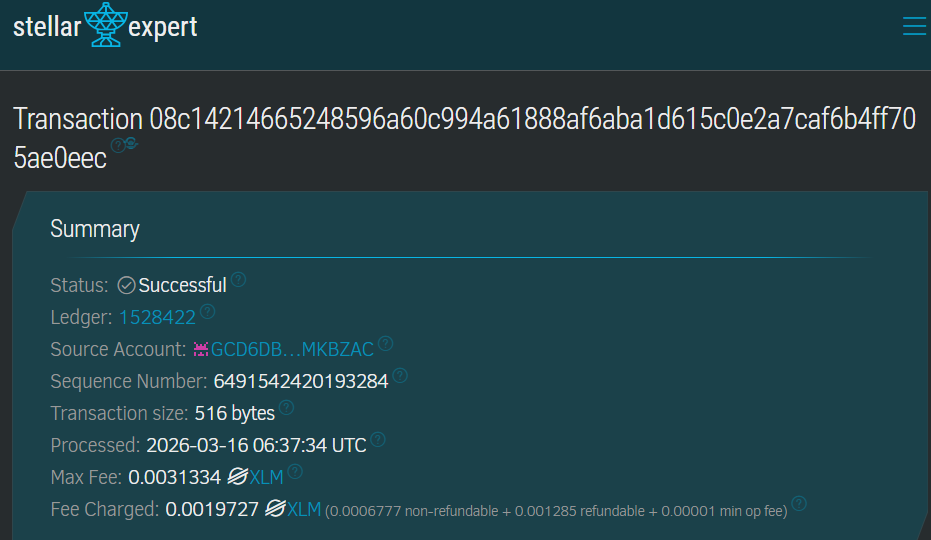
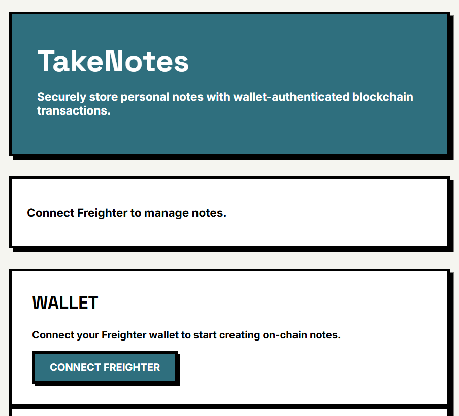

# TakeNotes

TakeNotes is a full-stack Web3 dApp built on Stellar Soroban that lets users create and manage personal notes as on-chain data. Authentication is wallet-based, so each user interacts with notes scoped to their own Stellar address.

This repository contains:

- A Soroban smart contract for note CRUD operations
- A reusable logger contract for event publishing
- A React + TypeScript frontend integrated with Freighter

## Why This Project

Traditional note apps rely on centralized databases and app-owned identity systems. TakeNotes demonstrates a decentralized alternative where:

- ownership is tied to wallet identity,
- write operations are signed by the user,
- and note state is persisted on-chain.

This project is intentionally practical: it is small enough to study end-to-end, but complete enough to show real contract/frontend integration patterns on Soroban.

## Core Features

- Wallet-authenticated note creation, update, deletion, and retrieval
- Per-wallet note isolation using address-scoped storage keys
- Duplicate-ID rejection at contract level
- Timestamps captured from ledger time
- Optional cross-contract logging of note activity
- Backward compatibility support for legacy deployments (`add_note`)
- Environment-based network switching (testnet/mainnet profiles)
- Client-side input sanitization and note field bounds

## Target Users

- Developers and early adopters exploring decentralized personal knowledge tools
- Privacy-conscious users who prefer wallet-based identity over email/password auth
- Teams experimenting with Soroban-powered application patterns

## Architecture

1. User connects Freighter wallet in the frontend.
2. Frontend builds contract invocation transactions.
3. Wallet signs write transactions.
4. Soroban RPC submits and confirms transactions.
5. Contract stores/retrieves notes from instance storage.

High-level flow:

```
React UI -> Freighter -> Soroban RPC -> TakeNotes Contract -> Stellar Testnet
																			\-> Logger Contract (optional)
```

## Repository Structure

```
takenotes/
├─ contracts/
│  ├─ hello-world/        # Main TakeNotes contract
│  └─ logger/             # Event logger contract
├─ frontend/              # React + TypeScript dApp
├─ images/                # Screenshots and docs assets
├─ Cargo.toml             # Workspace configuration
└─ README.md
```

## Smart Contract Design (TakeNotes)

Location: `contracts/hello-world/src/lib.rs`

### Data Model

Each note stores:

- `id: u32`
- `title: String`
- `content: String`
- `timestamp: u64`

Storage uses `DataKey::Notes(Address)` so every wallet has its own note vector.

### Public Functions

- `create_note(user, id, title, content) -> bool`
	- Requires auth
	- Rejects duplicate note IDs
	- Appends a new note and returns `true` on success

- `update_note(user, id, title, content) -> bool`
	- Requires auth
	- Updates existing note by ID

- `delete_note(user, id) -> bool`
	- Requires auth
	- Removes note by ID

- `get_notes(user) -> Vec<Note>`
	- Read-only retrieval for a wallet address

- `set_logger(logger_id)`
	- Configures logger contract address for cross-contract event calls

- `add_note(user, id, text)`
	- Legacy compatibility entrypoint
	- Internally delegates to `create_note` with empty title

## Logger Contract

Location: `contracts/logger/src/lib.rs`

The logger contract publishes events with:

- Topic: `("note_action", sender)`
- Payload: message string (for example, `"Note Created"`)

The TakeNotes contract can call it when logger is configured.

## Frontend Application

Location: `frontend/`

The frontend provides:

- Wallet connection status and reconnect action
- Note creation form with basic client-side validation
- Note list with timestamp rendering and descending order
- Edit mode for updates
- Delete actions with optimistic UI refresh path
- Transaction status/error messaging around wallet approval and chain confirmation

Contract integration is implemented in `frontend/src/services/contractService.ts`.

## Local Development

### 1) Build and test contracts

From `contracts/hello-world`:

```bash
make build
make test
```

### 2) Run frontend

From `frontend`:

```bash
npm install
npm start
```

Create `frontend/.env` (or `.env.local`) with:

```bash
REACT_APP_CONTRACT_ID=<deployed_contract_id>
REACT_APP_STELLAR_NETWORK=testnet
REACT_APP_SOROBAN_RPC_URL=https://soroban-testnet.stellar.org
REACT_APP_NETWORK_PASSPHRASE=Test SDF Network ; September 2015
REACT_APP_IPFS_UPLOAD_URL=https://api.pinata.cloud/pinning/pinJSONToIPFS
REACT_APP_IPFS_UPLOAD_TOKEN=<pinata_jwt>
REACT_APP_IPFS_GATEWAY=https://ipfs.io/ipfs
```

Phase 3 uses client-side encryption in the browser and stores only IPFS CIDs on-chain.

For mainnet, update the following variables:

```bash
REACT_APP_STELLAR_NETWORK=mainnet
REACT_APP_SOROBAN_RPC_URL=<mainnet_soroban_rpc>
REACT_APP_NETWORK_PASSPHRASE=Public Global Stellar Network ; September 2015
REACT_APP_CONTRACT_ID=<mainnet_contract_id>
REACT_APP_LOGGER_CONTRACT_ID=<mainnet_logger_id>
```

### 3) Production build (frontend)

```bash
npm run build
```

## Testing Status

- Contract unit test exists for CRUD behavior in `contracts/hello-world/src/test.rs`
	- create
	- duplicate create rejection
	- update
	- delete

Frontend currently uses the default CRA/Jest setup and can be extended with integration tests for wallet and contract interaction paths.

## User Onboarding (Level 5)

- Google Form (required fields):
	- Name
	- Email
	- Wallet Address
	- Product Rating (1-5)
	- Open feedback
- Google Form link: `TODO_ADD_FORM_LINK`
- Exported response sheet (CSV/XLSX): `TODO_ADD_SHEET_LINK`
- User validation dataset template (CSV):

```csv
user_alias,wallet_address,action_performed,tx_hash,timestamp_utc
```

- Feedback dataset template (CSV):

```csv
name,email,wallet_address,product_rating,feedback
```

## User Feedback Summary

Status: Beta feedback collected from early adopters.

### Sample Feedback Entries

| Name | Rating | Feedback |
|------|--------|----------|
| Alex Chen | 4.5/5 | "The wallet integration is seamless. Love that my notes are stored on-chain. Would appreciate a dark mode for late-night note-taking sessions." |
| Jordan Smith | 5/5 | "Finally, a note app where I own my data! The history panel showing all versions is incredibly useful for tracking changes. Great work on the encryption feature." |
| Morgan Lee | 3.5/5 | "Good concept, but I found the encryption secret management confusing at first. Maybe add a help tooltip explaining how to safely store the encryption key?" |
| Casey Rodriguez | 4/5 | "Solid app. The IPFS integration adds confidence that my notes are truly decentralized. Would like to see bulk import/export for migrating from other note apps." |
| Taylor Watson | 4.5/5 | "Impressed with the speed and reliability. The note history feature is a game-changer for my research workflow. One request: allow me to add custom categories beyond 'General'." |

### Feedback Trends

- **Positive:** Users appreciate wallet-based identity, on-chain storage, and version history
- **Friction points:** Encryption secret management, lack of dark mode, limited category customization
- **Common request:** Bulk import/export, improved UI documentation

Planned improvements for next iteration:

- Add dark mode toggle in UI settings
- Improve encryption secret UX with better tooltips and security guidance
- Allow custom category creation instead of predefined list
- Implement bulk import/export functionality

## Improvement Implemented From Feedback Loop

Implemented improvement in this iteration:

- Added stronger form input sanitization and limits for title/content/category/tags.
- Added runtime-config module for environment-based network switching (testnet/mainnet) to reduce hardcoded deployment coupling.

Code evidence:

- `frontend/src/components/NoteForm.tsx`
- `frontend/src/utils/sanitize.ts`
- `frontend/src/config/runtimeConfig.ts`

Commit link(s): `TODO_ADD_COMMIT_LINKS`

Verification log template:

```text
Date (UTC):
Environment: testnet/mainnet
Frontend commit:
Contract commit:
Frontend tests:
Contract tests:
E2E wallet flow:
Transactions observed:
Result: pass/fail
Notes:
```

CI gate:

- `.github/workflows/ci.yml` runs contract tests and frontend tests/build on push and PR.

## Mainnet Transition Plan

### Environment Configuration Changes

- Switch `REACT_APP_STELLAR_NETWORK` to `mainnet`.
- Point `REACT_APP_SOROBAN_RPC_URL` to a production Soroban RPC endpoint.
- Set `REACT_APP_NETWORK_PASSPHRASE` to Stellar public network passphrase.
- Replace contract IDs with mainnet deployments.

### Contract/API Switching Strategy

- Frontend services read contract IDs and endpoints from environment variables.
- No contract IDs are hardcoded in component code.
- IPFS gateway/upload endpoints are environment-driven.

### Security Improvements Before Launch

- Keep wallet signing in Freighter only; never expose private keys.
- Enforce input sanitization and size limits (already added in frontend form layer).
- Add rate limiting/auth in any future backend API proxy before production traffic.
- Keep upload tokens in deployment secrets, never in source control.

### Deployment Checklist

- Build and test smart contracts against mainnet-compatible release artifacts.
- Deploy contracts and update environment variables.
- Run smoke tests for create/update/delete + history + activity feed.
- Verify observability (RPC errors, wallet signing failures, IPFS upload failures).
- Keep rollback path ready:
	- Previous frontend deployment artifact
	- Previous known-good contract IDs
	- Environment-variable rollback procedure

### Release and Rollback Runbook (Inline)

Release preconditions:

- CI green on latest commit.
- Frontend tests pass.
- Contract tests pass.
- Environment values verified for target network.

Manual release steps:

1. Build contracts.
2. Deploy contracts to target network.
3. Update frontend env values for network + contract IDs.
4. Build frontend artifact.
5. Deploy frontend artifact.
6. Run smoke flow (connect, create, update, delete).

Rollback steps:

1. Redeploy previous known-good frontend artifact.
2. Restore previous known-good env values.
3. Re-point to previous known-good contract IDs.
4. Re-run smoke flow to confirm recovery.

Recovery objective: less than 30 minutes.

### Risks Before Mainnet Launch

- Real-user onboarding evidence is still pending and required for final sign-off.
- Cost profile (gas + infra) still needs production load sampling.
- End-to-end wallet/network mismatch handling should be validated with multiple wallet versions.

## Level 5 Tracking (Single-README Mode)

Use this checklist directly in this README.

- [x] Functional MVP (contract + frontend flow implemented)
- [x] Mainnet-ready runtime config + validation
- [x] Security hardening (frontend sanitization + contract validation)
- [x] CI test gates for frontend and contracts
- [x] Deployment + rollback process documented
- [ ] 5+ real users onboarded on testnet
- [ ] Google Form responses exported and cleaned
- [ ] Feedback analysis completed from real responses
- [ ] At least one user-feedback-driven improvement linked with commits
- [ ] Final evidence links filled (form, sheet, commit links)

## Known Compatibility Notes

- Frontend supports older deployments that only expose `add_note` for note creation.
- Update/delete require modern contract methods (`update_note`, `delete_note`).
- If those methods are missing in a deployed contract, frontend surfaces explicit compatibility errors.

## Deployment References

- Testnet transaction:
	https://stellar.expert/explorer/testnet/tx/1aa57771d0b2c3814ae4bcd823776f86b738213077191162aa51d0f76082855d!
- Testnet contract reference:
	https://lab.stellar.org/r/testnet/contract/CBMLFQ25PGW3LELR24SWC3QFASDM4VTNS74TUAIJV7J3UC3LN2XEZMEQ
- Frontend deployment:
	https://takenotes-delta.vercel.app/

## Screenshots





## List of Wallet Address
- 'GCVBGPRU7YSL7NTK4WQ5SRGE4RC5CV7KNYBVJLNPKMMOUQRFPGRZRF2R'
- 'GAUWUM7L4UV7NFRCZ5YXWANZL7ZKH4FCV3BMBVOR2N55Y2KVRO5CK3YC'
- 'GDFKRCE7XGJYEBLH3TLBSFQN53ZHRBMABS34ZF7MNKJLQ7EDUIMJIVI6'
- 'GCWBLWN4SQVFCDD7W7YUVXAIKJA2PCPX4UZ3P2E5N4UN7WXO6KF22SOA'
- 'GA2SEP3TWRTTXN345RT3MRQWSQDDAHAXNOBNDRCN4JCDMYHMZWS53ET3'
- 'GCYMOPQAYSAEJPT3J474KMCGBMARAN2FXA3TFYRYEZQPNRO4KNZAX675'
